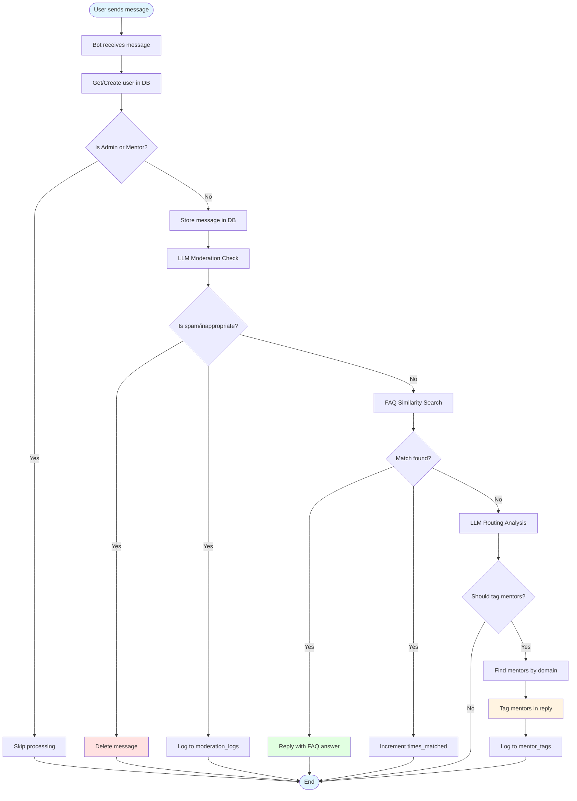
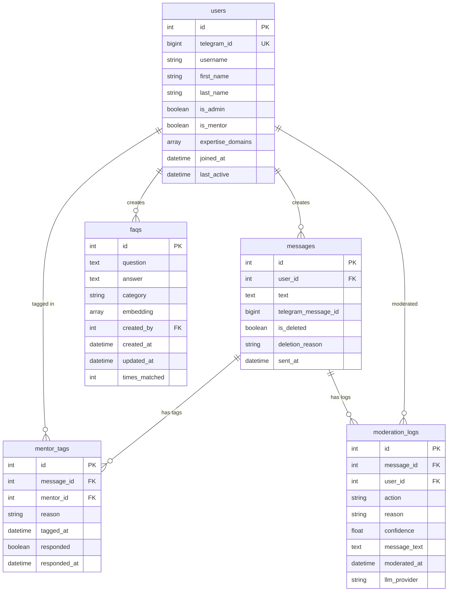

# ML Bytes Telegram Bot

Agentic community management bot with auto-moderation, FAQ matching, and mentor routing.

## Features

- Auto-moderation with LLM-based spam/content filtering
- Smart FAQ responses using semantic similarity (RAG)
- Automatic mentor tagging for domain-specific questions

## Setup

```bash
# Install
pip install -r requirements.txt

# Configure
cp .env.example .env
# Edit .env with your tokens and credentials

# Initialize data
python -m bot.utils.load_faqs      # Load FAQs
python -m bot.utils.sync_mentors   # Sync mentors

# Run
python -m bot.main
```

## Configuration

Required in `.env`:
- `TELEGRAM_BOT_TOKEN` - From @BotFather
- `DATABASE_URL` - PostgreSQL connection
- `LLM_PROVIDER` - openai/anthropic/gemini
- `OPENAI_API_KEY` / `ANTHROPIC_API_KEY` / `GEMINI_API_KEY`
- `ADMIN_IDS` - Comma-separated Telegram user IDs
- `MENTOR_DOMAINS` - JSON: `{"domain": [user_id1, user_id2]}`

## Architecture Overview

### Message Processing Flow



### Database Schema



## Project Structure

```
bot/
├── handlers/       # Telegram update handlers
├── services/       # Business logic (moderation, FAQ, routing)
├── llm/           # LLM provider wrappers
├── db/            # Database models
└── utils/         # Config, logging, utilities
```

## Tech Stack

python-telegram-bot • SQLAlchemy • pgvector • OpenAI/Anthropic/Gemini
